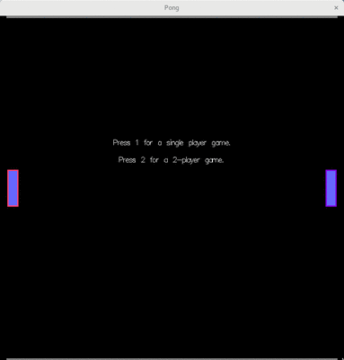

# Pong

A simple pong game implemented in Haskell, using the Gloss library, and SDL2 for
sounds and music.

### Building Pong

Pong was built using the command-line tool `cabal`, also known as cabal-install.
If you do not already have this installed, find out how to do so at [Haskell
Home Page](https://www.haskell.org/downloads), under the section titled "Minimal
installers".

For example, on openSUSE, this was as easy as:

    sudo zypper install ghc cabal-install
    cabal update

Once you have the GHC compiler and `cabal` installed on your system, you can
build Pong. I **highly** recommend using a Cabal sandbox for building Pong.
After you have cloned the repo with `git clone
https://github.com/htoigo/pong.git`, move into the newly-created Pong directory
with `cd pong`--then create a new sandbox, install the required dependencies
into it (which will be isolated from any system-wide Haskell install), and build
Pong:

    cabal sandbox init
    cabal install --only-dependencies
    cabal build

You are now ready to play Pong!

### Usage

Start a game of Pong by invoking:

    cabal run pong

from the Pong directory. Press '1' to begin a single player game, and press '2'
to begin a 2-player game. The left-hand player uses the 'w' and 's' keys to move
her paddle up and down, while the right-hand player uses the up and down arrow
keys. Other keys used are:

    'SPACE' pause/unpause the game
    'ESC'   abort the game, closing the window
    'r'     reset the game after it has ended

### Contributing

Rather than contributing here, please consider working through Andrew
Gibiansky's excellent tutorial yourself. (See the Credits section, below.)

### Credits

This little Haskell game grew out of my working through the excellent tutorial
blog post ["Your First Haskell Application (with
Gloss)"](http://andrew.gibiansky.com/blog/haskell/haskell-gloss) by Andrew
Gibiansky, used under [CC
BY-SA](https://creativecommons.org/licenses/by-sa/4.0). It really is a great
resource for learning to build a Haskell application using Cabal. Thanks,
Andrew! For someone with some experience programming in Haskell, but who has
never before built a Cabal application, the included code gives you a solid
foundation from which to build, and the exercises, especially, are meaty with
just the right level of challenge to get you thoroughly engrossed. Go check it
out!

### License

New code contributions are licensed under the [GNU General Public License
version 3](https://www.gnu.org/copyleft/gpl.html). New content is licensed under
[CC BY-SA](https://creativecommons.org/licenses/by-sa/4.0). See the LICENSE file
for details.
