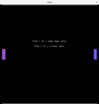
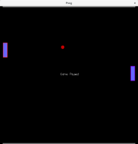
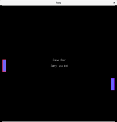

# pong

A simple pong game implemented in Haskell, using the Gloss library.

## Installation

...
`git clone https://github.com/htoigo/pong.git`
...

## Usage

After installing on your computer, you can run pong by ...

The intial game view.

Paused in the middle of a game.

Game over... :-(

## Contributing

Rather than contributing here, please consider working through Andrew
Gibiansky's excellent tutorial yourself. (See the Credits section, below.)

## Credits

This little Haskell game grew out of my working through the excellent tutorial
blog post ["Your First Haskell Application (with
Gloss)"](http://andrew.gibiansky.com/blog/haskell/haskell-gloss) by Andrew
Gibiansky, used under [CC
BY-SA](https://creativecommons.org/licenses/by-sa/4.0). It really is a great
resource for learning to build a Haskell application using Cabal. Thanks,
Andrew! For someone with some experience programming in Haskell, but who has
never before built a Cabal application, the included code gives you a solid
foundation from which to build, and the exercises, especially, are meaty with
just the right level of challenge to get you thoroughly engrossed. Go check it
out!

## License

New code contributions are licensed under the [GNU General Public License
version 3](https://www.gnu.org/copyleft/gpl.html). New content is licensed under
[CC BY-SA](https://creativecommons.org/licenses/by-sa/4.0). See the LICENSE file
for details.
